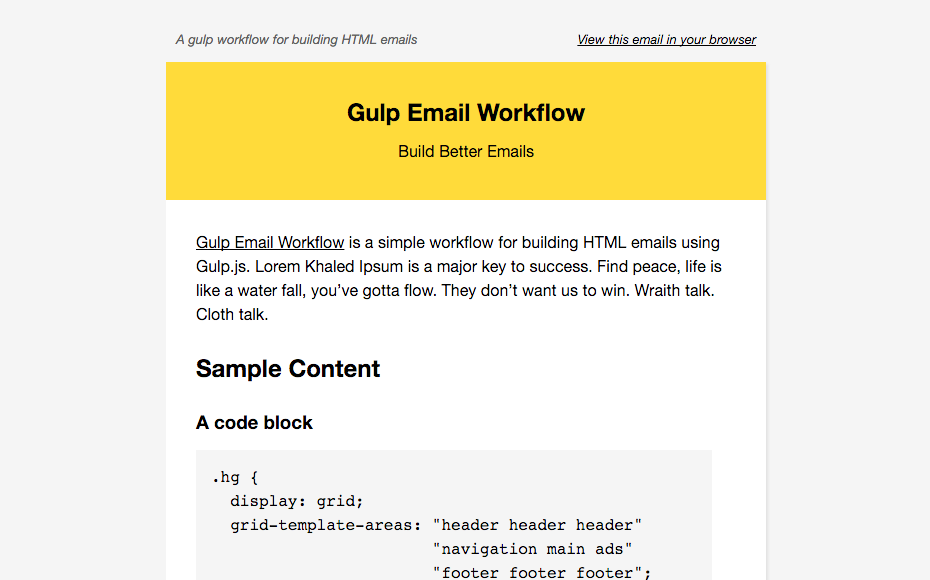

# A Gulp Workflow for Building HTML Emails




This is a workflow for building HTML emails using Gulp. It comes with a default MailChimp-supported template.

What it does -

1. Builds HTML from templates and partials
2. Compiles SCSS to CSS
3. Inlines your inline.css file
4. Embeds your embedded.css file
5. Generates a preview of emails


## Getting Started


**1. Clone this repository**


```
git clone https://github.com/ireade/gulp-email-workflow.git
cd gulp-email-workflow
```

Or download as a ZIP file.


### 2. Install packages

```
npm install
```


### 3. Start build

```
npm start
```

The compiled and inlined output email will be in the `build/` directory.


## How to use

### Creating templates

This working uses [Nunjucks](https://mozilla.github.io/nunjucks/) for compiling template files to HTML.

Templates are stored in `src/templates/` and partials in `src/templates/partials`. To create a template, create a file in the templates directory with the `.nunjucks` file extension. 

To include a partial in your template, use the following syntax -


```

```

To define a block of dynamic content to be replaced by the email file, use the following syntax -

```

```


### Creating emails from templates

To create an email based off a template file, create a new file in the `src/emails/` directory.

To use a template file, use the following syntax -

```

```

To define the contents of a dynamic content block, use the following syntax -

```
 
Lorem ipsum dolor sit amet

```


### Working with global data

Global data is stored in the `src/data` directory as JSON files. 


### CSS

SASS files are stored in the `src/sass/` directory. There are two SASS files -

- `inline.scss` for styles you want to be inlined to their elements
- `embedded.scss` for styles that shouldn't be inlined. These will be inlcluded within a `<style>` element in the `<head>`

You can create subdirectories within the SASS folder to hold any partials. 


